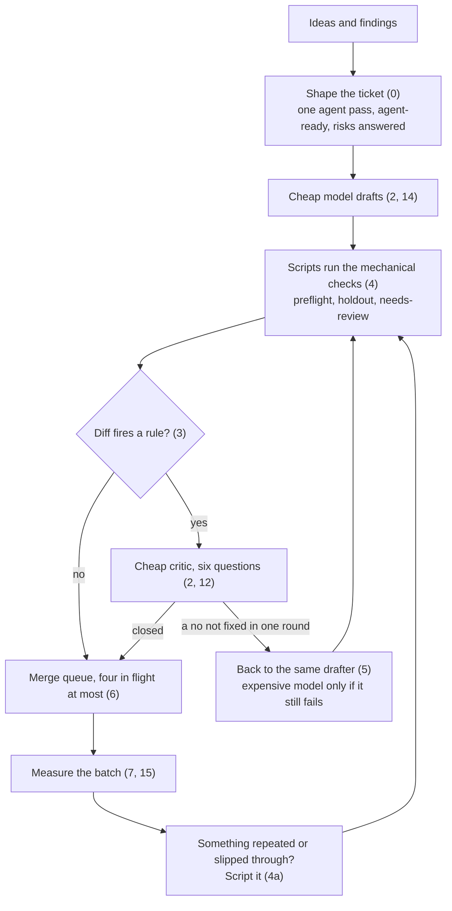

<picture>
  <source media="(prefers-color-scheme: dark)" srcset="assets/logo-dark.svg">
  
</picture>

# Lean agent

Run AI coding agents over a ticket backlog without burning a plan in a night.

[](https://github.com/arnelirobles/lean-agent/releases) [](https://github.com/arnelirobles/lean-agent/actions/workflows/ci.yml) [](LICENSE)

Lean agent is a method and a Claude Code plugin. The method is how I ran agents over my own backlog after burning through a plan in one night in September 2026. The plugin is the part of the method that runs by itself: skills, scripts on the agent's PATH, and hooks that block or note.

The numbers here are mine, at list prices, on one .NET codebase. Treat them as a shape, not a benchmark.

## The short version

Shape the ticket for the agent before anyone starts: one ticket is one agent pass, written so the agent needs nothing else, with the review's questions answered in advance. A cheaper model drafts every change, and a fast one finds code and runs the gates. Scripts, not instructions, run the mechanical checks. A cheap critic reviews every change against six fixed questions. The expensive model only sees what the critic cannot close. At most four changes in flight.

That took me from about 13 dollars of model use per change to about 9, with no drop in what got caught. Until 1.4.0 this line said 66 and 25: the cost script counted each message's usage once per transcript row, and its prices were those of older models. [Section 7](https://github.com/arnelirobles/lean-agent/wiki/Measure-Every-Batch) has the correction.



The numbers in brackets are sections of the method. Each one is a page in the [wiki](https://github.com/arnelirobles/lean-agent/wiki/Home).

## Why three models

Each step goes to the cheapest model that can do it without losing a defect.

| Model | Runs | List price per million tokens, in and out |
| --- | --- | --- |
| Haiku (fast) | finding code, running the gates and pasting their output, collecting the retro's numbers | 0.10 and 0.50 |
| Sonnet (cheap) | spec review, every draft, the critic's hunt and refute, the first fix round | 2 and 10 |
| Opus (strong) | a finding not fixed in one round, an unsure answer on core code | 4 and 20 |

Haiku is 20 times cheaper than Sonnet and faster, so work that only reads and reports costs almost nothing. It never answers a yes or no about code. A small model that wrongly throws out a finding drops a real defect with no trace, so the critic stays on Sonnet.

What this saves depends on how much of a change's cost was searching and running scripts. Most of it is the draft and the critic, which do not move. The Haiku split has not been measured on a batch yet. Run `lean-stats report` after one: it prints cost by role, and `search`, `gate` and `retro` are the Haiku roles. If they stay under a few percent of the spend, the saving is small and `LEAN_MODEL_FAST=sonnet` changes nothing that matters.

## Install

```bash
claude plugin marketplace add arnelirobles/lean-agent
claude plugin install lean-agent@lean-agent
```

Update with `claude plugin update lean-agent@lean-agent`. Claude Code picks up a change only when the plugin version moves. More in [Installation](https://github.com/arnelirobles/lean-agent/wiki/Installation).

## What you get

| Part | What it does | Reference |
| --- | --- | --- |
| `method` skill | The condensed rules. The agent loads it when it plans, files, reviews or finishes a batch. You do not call it. | [The cascade](https://github.com/arnelirobles/lean-agent/wiki/The-Cascade) |
| `/lean-agent:shape-ticket` | Writes an issue in the agent-ready shape, after searching for one it belongs to. | [Shape the ticket](https://github.com/arnelirobles/lean-agent/wiki/Shape-the-Ticket) |
| `/lean-agent:adversarial-review` | The critic: one agent hunts, a second tries to refute. | [Adversarial critic](https://github.com/arnelirobles/lean-agent/wiki/Adversarial-Critic) |
| `/lean-agent:lean-retro` | The retro that changes the method from numbers. | [Self-improving retro](https://github.com/arnelirobles/lean-agent/wiki/Self-Improving-Retro) |
| Scripts in `bin/` | Preflight, holdout, needs-review, cost, hygiene and more, on the agent's PATH. Each has a `--self-test`. | [Scripts](https://github.com/arnelirobles/lean-agent/wiki/Scripts) |
| Hooks | Three block (attribution and slop in public text, a bad commit author, files in a scratchpad root). The rest add a note and never stop the call. Each has an off switch. | [Hooks](https://github.com/arnelirobles/lean-agent/wiki/Hooks) |
| `lean-stats` | One local SQLite file of tokens, reviews, merges and hook fires. Nothing leaves the machine. | [Measure every batch](https://github.com/arnelirobles/lean-agent/wiki/Measure-Every-Batch) |

Everything in the method still works without the plugin. The scripts at the root are links into `bin/`.

## Settings

Set these in the `env` block of your Claude Code settings. The defaults run the method as written.

| Variable | Default | Effect |
| --- | --- | --- |
| `LEAN_AGENTS` | `many` | `one` runs everything in one session: no subagents, one ticket at a time. |
| `LEAN_MODELS` | `mixed` | `one` keeps every step on the session's model: no cheap drafter, no escalation. |
| `LEAN_MODEL_CHEAP` | `sonnet` | The model that drafts and critiques. |
| `LEAN_MODEL_STRONG` | `opus` | The model that takes what the cheap steps could not close. |
| `LEAN_MODEL_FAST` | `haiku` | The model for agents that read and report: code search, running the gates, the retro's fact collection. It never judges code. |
| `LEAN_STATS` | on | `off` stops every `lean-stats` write. |

Every off switch for a hook is in [Settings](https://github.com/arnelirobles/lean-agent/wiki/Settings).

## The method

| Section | Page | In one line |
| --- | --- | --- |
| 0 | [Shape the ticket for the agent](https://github.com/arnelirobles/lean-agent/wiki/Shape-the-Ticket) | Write each ticket so one agent pass finishes it with nothing else to read. |
| 1 | [Triage inline, no agents](https://github.com/arnelirobles/lean-agent/wiki/Triage) | Sort the backlog yourself into three tiers and do tier 0 by hand. |
| 2 | [The cascade](https://github.com/arnelirobles/lean-agent/wiki/The-Cascade) | A cheap model drafts, a cheap critic reviews, the strong model sees only what stays open. |
| 3 | [The diff decides whether a critic runs](https://github.com/arnelirobles/lean-agent/wiki/When-the-Critic-Runs) | Rules over the diff, not the ticket title, decide whether a critic runs. |
| 4 to 4a | [Scripts, not instructions](https://github.com/arnelirobles/lean-agent/wiki/Scripts-Not-Instructions) | Mechanical checks live in scripts. Reasoning an agent does twice becomes a script. |
| 5 to 6 | [Rework and concurrency](https://github.com/arnelirobles/lean-agent/wiki/Rework-and-Concurrency) | Fixes go back to the agent that wrote the change. At most four changes in flight. |
| 7 | [Measure every batch](https://github.com/arnelirobles/lean-agent/wiki/Measure-Every-Batch) | Cost per change and what the critic missed, after every batch. |
| 8 | [Attack your own method](https://github.com/arnelirobles/lean-agent/wiki/Attack-Your-Own-Method) | Test the method against real defects before you trust it. |
| 9 | [Half of what an agent makes is not text](https://github.com/arnelirobles/lean-agent/wiki/Non-Text-Output) | Gate images and other bytes that text checks cannot read. |
| 10 | [A check that passes having checked nothing](https://github.com/arnelirobles/lean-agent/wiki/Checks-That-Check-Nothing) | Make every check fail when it is handed nothing to check. |
| 11 | [The machine has a ceiling too](https://github.com/arnelirobles/lean-agent/wiki/Machine-Ceiling) | Queue heavy commands per toolchain and run agent work at the lowest priority. |
| 12 | [The adversarial critic](https://github.com/arnelirobles/lean-agent/wiki/Adversarial-Critic) | One agent hunts, a second tries to prove each finding wrong. Repository rules first. |
| 13 | [Every finding is an interaction](https://github.com/arnelirobles/lean-agent/wiki/Interaction-Surface) | Look at what the diff touches but did not write, before you push. |
| 14 | [Cheap drafting works, and it stops short](https://github.com/arnelirobles/lean-agent/wiki/Cheap-Drafting) | Where a cheaper drafter holds up and where it stops. |
| 14a to 14h | [Field notes from parallel agents](https://github.com/arnelirobles/lean-agent/wiki/Field-Notes) | Leftover processes, shared scratchpads, wait loops, stacked pull requests, deploys, rehearsals, local CI, steps for a person. |
| 15 | [What a reader should observe](https://github.com/arnelirobles/lean-agent/wiki/What-to-Observe) | The six results to look for, and the two goals that poison themselves. |
| 16 | [The method improves itself](https://github.com/arnelirobles/lean-agent/wiki/Self-Improving-Retro) | A scheduled retro that turns the numbers into changes to the method. |

## Requirements

- Claude Code with plugin support.
- `python3`, `git` and `gh` on PATH.
- Linux, or macOS with its stock bash 3.2. `heavy.sh` needs util-linux `flock` and `/proc` and refuses to run without them.

## Contributing

A change to `skills/`, `hooks/`, `bin/` or `lib/` moves the version in `.claude-plugin/plugin.json`, and the merge is tagged `v<version>`. `tests/run-all.sh` runs every `--self-test`, lists scripts that have none, and fails when those folders changed since the current version's tag. CI runs it on Ubuntu for every pull request.

A script that works on any repository belongs here, as a pull request with its test and a line on the [Scripts](https://github.com/arnelirobles/lean-agent/wiki/Scripts) page. See [Scripts, not instructions](https://github.com/arnelirobles/lean-agent/wiki/Scripts-Not-Instructions#4a-the-second-time-an-agent-reasons-its-way-through-something-it-becomes-a-script).

## What this does not fix

A backlog with no definition of finished refills faster than it drains. Automation widens the drain. It does not close the tap. Decide what done means first.

## Licence

MIT. Take it, change it, ship it.
